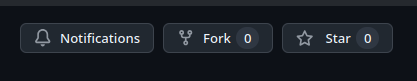

# S08.s1 - Práctica: Representaciones Cromosómicas en Algoritmos Genéticos

## 📚 Descripción

Esta práctica implementa las tres representaciones cromosómicas fundamentales en Algoritmos Genéticos aplicadas a un problema real de distribución equitativa de estudiantes en exámenes.

### Problema a resolver
Un docente tiene 39 alumnos y necesita distribuirlos en 3 exámenes diferentes (A, B, C) con 13 alumnos cada uno. El objetivo es lograr que los grupos sean equilibrados en términos de rendimiento académico.

## 🧬 Representaciones Implementadas

### 1. Representación Binaria (`representacion_binaria.py`)
- **Cromosoma**: 117 bits (39 alumnos × 3 bits cada uno)
- **Codificación**: Cada alumno tiene 3 bits, solo uno activo indicando su examen
- **Ejemplo**: `[0,1,0]` = alumno asignado al examen B
- **Ideal para**: Problemas de selección y asignación discreta

### 2. Representación Real (`representacion_real.py`)
- **Cromosoma**: 117 valores reales (39 alumnos × 3 pesos normalizados)
- **Codificación**: Cada alumno tiene 3 valores que suman 1.0
- **Ejemplo**: `[0.2, 0.5, 0.3]` = probabilidades para A, B, C
- **Ideal para**: Optimización con variables continuas

### 3. Representación Permutacional (`representacion_permutacional.py`)
- **Cromosoma**: Permutación de 39 índices
- **Codificación**: Posiciones [0-12] → A, [13-25] → B, [26-38] → C
- **Ejemplo**: `[34, 25, 32, ...]` = orden de asignación
- **Ideal para**: Problemas de ordenamiento y secuenciación

## 🚀 Instalación y Uso

### Opción 1: Entorno Local
```bash
# Clonar el repositorio
git clone https://github.com/GxJohan/algoritmos_evolutivos/
cd algoritmos_evolutivos

# Cambiar a la rama de laboratorio (contiene los archivos de la sesión)
git checkout s8_lab

# Crear entorno virtual
python3 -m venv venv
source venv/bin/activate  # En Windows: venv\Scripts\activate

# Instalar dependencias
pip install -r requirements.txt

# Ejecutar ejemplos
python representacion_binaria.py
python representacion_real.py
python representacion_permutacional.py
```

### Opción 2: Google Colab
```python
# En una celda de Colab:
!git clone https://github.com/GxJohan/algoritmos_evolutivos/
%cd algoritmos_evolutivos
!git checkout s8_lab
!pip install -r requirements.txt

# Ejecutar los archivos
!python representacion_binaria.py
```

## 📊 Datos de Entrada

El archivo `notas_1u.csv` contiene las notas de los 39 alumnos con su asignación original:
- Columnas: Alumno, Nota, Tipo_Examen
- Notas: Escala de 0 a 20
- Distribución original desequilibrada

## 🎯 Actividades para Estudiantes

### Actividad 1: Análisis Comparativo
1. Ejecuta los tres programas y compara los resultados
2. ¿Cuál representación logra mejor equilibrio entre los grupos?
3. ¿Cuál converge más rápido? (observa las generaciones)
4. Documenta tus observaciones en un archivo `analisis.txt`

### Actividad 2: Modificación de Fitness
1. En `representacion_binaria.py`, modifica la función `calcular_fitness` para:
   - Penalizar grupos con varianza alta de notas
   - Premiar diversidad (mezclar alumnos de diferentes rendimientos)
2. Compara los resultados con la versión original

### Actividad 3: Nuevo Operador Genético
1. En `representacion_real.py`, implementa un operador de mutación diferente:
   ```python
   def mutacion_gaussiana(cromosoma, sigma=0.1):
       # Tu implementación aquí
       # Debe mantener la normalización (suma = 1)
   ```
2. Prueba con diferentes valores de sigma

### Actividad 4: Restricciones Adicionales
1. Modifica `representacion_permutacional.py` para agregar una restricción:
   - Los alumnos con notas < 11 no pueden estar todos en el mismo examen
2. Ajusta la función de fitness para penalizar soluciones que violen esta restricción

### Actividad 5: Visualización (Avanzado)
1. Crea un nuevo archivo `visualizacion.py` que:
   - Grafique la evolución del fitness por generación
   - Muestre un histograma de notas por examen
   - Compare las distribuciones de las 3 representaciones
2. Usa matplotlib o seaborn para las gráficas

### Actividad 6: Problema Extendido
1. Modifica uno de los programas para distribuir los alumnos en 4 exámenes
2. ¿Qué cambios necesitas hacer en el cromosoma?
3. ¿Cómo afecta esto a la convergencia del algoritmo?

## 📝 Flujo de Trabajo y Entregables para Estudiantes

Para completar y entregar la práctica, sigue estos pasos. Este es el flujo de trabajo estándar utilizado en proyectos de software colaborativos.

### Paso 1: Crea tu Propia Copia del Repositorio (Fork)

1.  Ve a la página principal del repositorio en GitHub: [https://github.com/GxJohan/algoritmos_evolutivos/](https://github.com/GxJohan/algoritmos_evolutivos/)
2.  Haz clic en el botón **"Fork"** en la esquina superior derecha. Esto creará una copia exacta del repositorio bajo tu propia cuenta de GitHub.

    

### Paso 2: Clona tu Fork a tu Máquina Local

Ahora, en lugar de clonar el repositorio original, clonarás **tu fork**.

```bash
# Reemplaza [TU_USUARIO_DE_GITHUB] con tu nombre de usuario
git clone https://github.com/[TU_USUARIO_DE_GITHUB]/algoritmos_evolutivos.git
cd algoritmos_evolutivos

# Ahora sigue las instrucciones de instalación y uso que ya conoces
git checkout s8_lab
python3 -m venv venv
source venv/bin/activate
pip install -r requirements.txt
```

### Paso 3: Realiza las Actividades

Con el entorno configurado, modifica los archivos y completa las actividades descritas en la sección `🎯 Actividades para Estudiantes`.

### Paso 4: Guarda y Sube tus Cambios a tu Fork

A medida que avances, guarda tu trabajo en tu repositorio de GitHub.

```bash
# Añade todos los archivos que has modificado
git add .

# Crea un "commit" con un mensaje descriptivo de tus cambios
git commit -m "Avance en las actividades de la S08"

# Sube los cambios a tu repositorio fork en GitHub
git push origin s8_lab
```

### Paso 5: Entrega de la Práctica

Para la entrega final, proporciona lo siguiente:

1.  **URL a tu Repositorio Fork**: El enlace a tu copia del proyecto en GitHub (ej. `https://github.com/[TU_USUARIO_DE_GITHUB]/algoritmos_evolutivos/`).
2.  **Informe en PDF** (2-3 páginas), que puede estar dentro del mismo repositorio, con:
    -   Comparación de las tres representaciones.
    -   Resultados y conclusiones de las actividades realizadas.
    -   Reflexión sobre cuándo y por qué usar cada tipo de representación.

## 🤔 Preguntas de Reflexión

1. ¿Por qué la representación binaria tuvo dificultades para lograr exactamente 13 alumnos por grupo?
2. ¿Qué ventajas tiene usar valores reales normalizados vs. selección directa?
3. ¿En qué casos la representación permutacional sería inadecuada?
4. ¿Cómo afecta el tamaño de la población y número de generaciones a la calidad de la solución?

## 📖 Material de Referencia

- `representaciones_cromosomicas.json`: Teoría completa sobre representaciones
- Documentación de NumPy: https://numpy.org/doc/
- Documentación de Pandas: https://pandas.pydata.org/docs/

## ⚡ Tips de Depuración

- Si el fitness es siempre -1000, revisa las restricciones de tamaño de grupo
- Para debugging, reduce población y generaciones
- Imprime cromosomas intermedios para entender la codificación
- Verifica que las mutaciones mantienen la validez del cromosoma

---
**Autor**: Ms. Ing. Johan Max Alexander López Heredia  
**Curso**: Algoritmos Evolutivos - 1411-2278